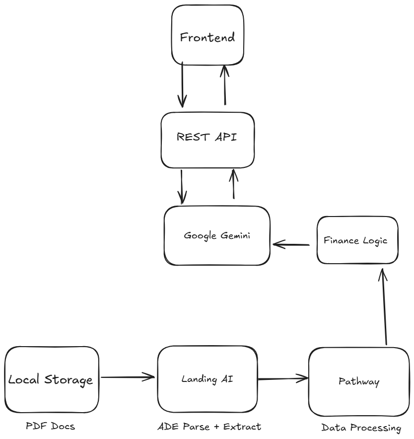

# Diligent 🔍

**AI-Powered M&A Due Diligence Assistant**

Diligent assists deal teams by extracting structured data from financial documents, performing semantic search across datarooms, and providing AI-generated insights with full citations. Built for analysts who need fast document review with transparent, verifiable sources.

> **⚠️ Important:** This tool **assists** analysts—it does **not** replace human judgment or comprehensive due diligence. Every answer must be verified against the cited source documents. This is an analytical aid, not a decision-making system.

---

## 🎬 Demo

[](https://youtu.be/QfwF3Uh10PY)

Note: Demo video includes all features as of October 5th, 2025

---

## � Use Cases We Cover

**What This Tool Does:**

1. **10-Q/10-K Report Analysis**
   - Extracts 39 financial fields (revenue, EBITDA, debt, margins, cash flow, etc.)
   - Computes 5 financial ratios (D/E, net margin, ROE, debt coverage)
   - Retrieves specific sections with citations (document name + chunk location)
   - Investment Committee Memo Generation

2. **CIM Review**
   - Extracts market size, growth rates, customer concentration
   - Finds operational KPIs (CAC, LTV, churn, market share)
   - Searches across multiple sections with semantic matching

3. **Contract Search & Extraction**
   - Locates change-of-control clauses
   - Finds assignment provisions and key dates
   - Returns exact document location with page/chunk reference

4. **Portfolio Dataroom Analysis**
   - Batch processes multiple documents
   - Cross-document question answering
   - Tracks citations across entire dataroom

5. **Risk Factor Identification**
   - Extracts customer concentration, regulatory risks, litigation
   - Flags threshold violations (high debt, low margins)
   - Provides cited evidence for each finding

**What This Tool Does NOT Do:**
- ❌ Full document summarization (use structured data store for summaries)
- ❌ Period-over-period trend analysis (single snapshot only)
- ❌ Replace analyst judgment or comprehensive due diligence
- ❌ Legal contract analysis or advice

---

## 🏗️ Architecture



### Data Flow

Upload sends PDFs to **LandingAI ADE** for parsing and structured field extraction (39 fields). **Marker** converts PDFs to markdown. **Pathway** normalizes extracted data and computes financial metrics. Text is chunked (1000 chars, 200 overlap) and indexed with **semantic embeddings** (sentence-transformers). Chat queries read from this indexed store: Gemini decomposes questions into sub-queries, **hybrid RAG** (70% semantic, 30% keyword) retrieves relevant chunks per sub-query, and Gemini synthesizes answers from structured data + retrieved spans. All citations include document name, chunk index, and sub-query attribution.

---

## Tech Stack

**Frontend:**
- Next.js 14 + React 19 + TypeScript
- Tailwind CSS + shadcn/ui components
- Lucide Icons

**Backend:**
- FastAPI + SQLModel (SQLite)
- **LandingAI ADE** – PDF parsing + 39-field structured extraction
- **Marker** – PDF to Markdown conversion
- **Pathway** – Data normalization + financial ratio computation
- **sentence-transformers** – Semantic embeddings (all-MiniLM-L6-v2, 384-dim)
- **Google Gemini AI** (`gemini-2.5-flash`) – Query decomposition + answer synthesis
- **ReportLab** – PDF export

**RAG System:**
- Hybrid indexing (semantic + keyword)
- Multi-query decomposition
- Citation tracking with sub-query attribution
- JSON-based index storage (`pathway_index/*.json`)

---

## Architecture & Data Flow

### **Upload Pipeline**
```
User uploads PDF
    ↓
Save to ./data_rooms/{task_id}/{filename}
    ↓
Parse with Marker → Markdown text
    ↓
Extract with LandingAI ADE → 39 fields (JSON)
    ↓
Compute metrics with Pathway → 5 ratios
    ↓
Generate rule-based insights → ⚠️/✅ flags
    ↓
Index for RAG:
  • Chunk text (1000 chars, 200 overlap)
  • Generate embeddings (all-MiniLM-L6-v2)
  • Save to pathway_index/{task_id}_index.json
    ↓
Store in SQLite:
  • documents table: filename, filepath, markdown, extraction_json (39 fields)
```

### **Chat Pipeline (Multi-Query RAG)**
```
User asks: "What are the financial risks?"
    ↓
Save question to chat_messages (status=pending)
    ↓
[BACKGROUND TASK]
    ↓
Load structured data from SQL (39 fields)
    ↓
Compute metrics with Pathway (5 ratios)
    ↓
Generate insights (threshold rules)
    ↓
Multi-Query RAG:
  1. Decompose query with Gemini → 3-5 sub-queries
     ["What is debt ratio?", "What are liquidity risks?", "What regulatory issues?"]
  
  2. For EACH sub-query:
     • Load RAG index (pathway_index/{task_id}_index.json)
     • Semantic search: cosine similarity (70%)
     • Keyword search: term frequency (30%)
     • Return top 5 chunks with metadata
  
  3. Collect citations:
     [{document: "10-Q.pdf", page: "Chunk 5", sub_query: "What is debt ratio?", ...}]
  
  4. Synthesize with Gemini:
     • Structured data (39 fields)
     • Computed metrics (5 ratios)
     • Rule insights
     • Retrieved chunks (grouped by sub-query)
     ↓
     Comprehensive answer in plain text
    ↓
Save to chat_messages:
  • content: answer text
  • reasoning_log: {sub_queries: [...], insights: [...]}
  • citations: [{document, page, sub_query, index}]
  • status: "done"
    ↓
Frontend displays:
  • Answer text
  • ▸ Analyzed via N queries (collapsible)
  • 📄 Sources: [doc1.pdf] [doc2.pdf] (pills)
```


---

## Models & APIs Used

| Service | Purpose | Cost |
|---------|---------|------|
| **LandingAI ADE** | PDF → Markdown + structured field extraction | Pay-per-document |
| **Google Gemini AI** | Natural language summary generation | Free tier: 15 req/min |
| **Pathway** | Data normalization and metric computation | Free (local library) |


---

## Installation

### Prerequisites
- Node.js 18+
- Python 3.10+
- API keys: [Google Gemini](https://makersuite.google.com/app/apikey) and [LandingAI](https://landing.ai/)

### Backend Setup

```bash
cd backend
python -m venv venv

# Windows
.\venv\Scripts\activate
# macOS/Linux
source venv/bin/activate

pip install -r requirements.txt
```

Create `backend/.env`:
```env
#Enter your Gemini API key
GEMINI_API_KEY=your_gemini_api_key

#Enter your Landing AI API key
LANDINGAI_API_KEY=your_landingai_api_key
```

Run backend:
```bash
uvicorn main:app --reload --port 8000
```

Backend: `http://localhost:8000` | API docs: `http://localhost:8000/docs`

---

### Frontend Setup

```bash
cd frontend
pnpm install  # or npm install
pnpm dev      # or npm run dev
```

Frontend: `http://localhost:3000`

---

## How to Use

1. **Create Dataroom** – Click "New Dataroom" in sidebar
2. **Upload PDF** – Must contain at least Revenue, Debt, and Equity fields
3. **View Insights** – Red flags popup shows leverage/liquidity warnings
4. **Ask Questions** – Type in chat (e.g., "What's the debt-to-equity ratio?")
5. **Export Memo** – Click "View Summary" → "Export to PDF"

---

## Project Structure

```
backend/
  ├── main.py              # FastAPI app
  ├── database.py          # SQLite setup
  ├── models.py            # Task, Document, ChatMessage, Memo schemas
  ├── routes/
  │   ├── tasks.py         # Dataroom CRUD
  │   ├── documents.py     # Upload → ADE → Pathway pipeline
  │   ├── chat.py          # Gemini chat with structured metrics
  │   └── memo.py          # PDF export
  └── services/
      ├── landing_ai.py    # ADE API client
      ├── pathway_client.py # Data normalization + ratio computation
      ├── finance_logic.py  # Rule-based insight generation
      └── gemini_client.py  # Gemini API wrapper

frontend/
  ├── app/                 # Next.js pages
  ├── components/          # React components
  │   ├── chat-interface.tsx
  │   ├── dataroom-sidebar.tsx
  │   └── upload-modal.tsx
  └── lib/api.ts           # API client
```

## License

MIT License


