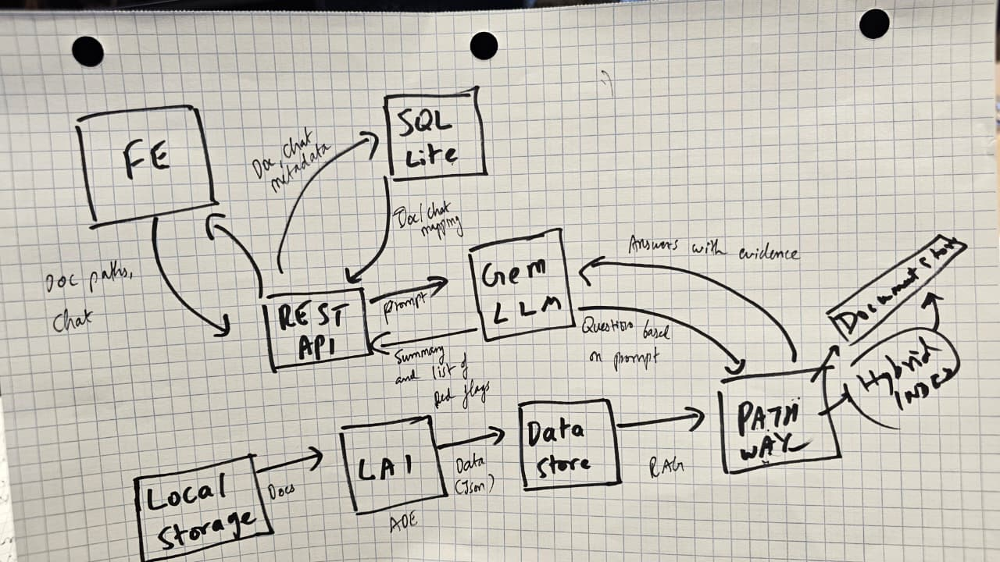

# Diligent 🔍

**AI-Powered Due Diligence Agent for M&A and IPO Transactions**

Diligent is an intelligent document analysis platform that automates due diligence workflows for mergers & acquisitions, IPOs, and investment transactions. Upload financial documents, contracts, and legal filings to get instant AI-powered insights, risk assessments, and comprehensive due diligence memos.

---

## ✨ Features

### 🤖 AI-Powered Chat Interface
- Interactive Q&A with your document dataroom
- Reasoning transparency with step-by-step analysis
- Source citations with document and page references
- Real-time progress tracking during analysis

### 📄 Intelligent Document Processing
- **Automated validation** on upload with red flag detection
- Support for PDFs, DOCX, XLSX, and more
- Batch document analysis with consolidated red flag reports
- Document indexing with RAG (Retrieval-Augmented Generation)

### 🚩 Risk Assessment
- Automatic red flag identification in contracts and filings
- Detection of:
  - Change-of-control clauses
  - Restrictive covenants
  - Pending litigation
  - Compliance deadlines
  - Regulatory penalties
  - Financial risks

### 📊 Live Due Diligence Memo
- Auto-generated executive summaries
- Key financial metrics tracking:
  - Revenue growth
  - Debt/Equity ratio
  - Free cash flow
  - Contract expiries
- Export to PDF/Excel
- Real-time updates as documents are analyzed

### 🏢 Multi-Project Management
- Create and manage multiple datarooms
- Color-coded risk levels (Healthy, Risky, Unknown)
- Task-based organization

---

## 🏗️ Architecture



> *High-level architecture showing the interaction between Frontend, Backend, RAG System, and AI services*

### Frontend
- **Framework:** Next.js 15.2.4 with React 19
- **UI:** Tailwind CSS + Radix UI components
- **Language:** TypeScript
- **State Management:** React hooks
- **API Communication:** RESTful API with polling

### Backend
- **Framework:** FastAPI
- **Database:** SQLModel (SQLite/PostgreSQL)
- **AI/ML:**
  - Google Gemini AI (gemini-1.5-flash)
  - Pathway RAG for document indexing
  - LandingAI ADE for document parsing
- **Document Processing:** Unstructured, pdf2image
- **Export:** ReportLab for PDF generation

---

## 🚀 Getting Started

### Prerequisites

- **Node.js** 18+ and **pnpm** (or npm)
- **Python** 3.10+
- **Google Gemini API Key** ([Get one here](https://makersuite.google.com/app/apikey))

### Installation

#### 1. Clone the Repository
```bash
git clone https://github.com/manuvikash/mna-agent.git
cd mna-agent
```

#### 2. Backend Setup

```bash
cd backend

# Create virtual environment
python -m venv venv
source .\venv\bin\activate

# Install dependencies
pip install -r requirements.txt

# Set up environment variables
# Create a .env file with:
GEMINI_API_KEY=your_api_key_here
LANDINGAI_API_KEY=your_api_key_here

# Run the backend
uvicorn main:app --reload --port 8000
```

Backend will be available at: `http://localhost:8000`

#### 3. Frontend Setup

```bash
cd frontend

# Install dependencies
pnpm install
# or: npm install

# Run the development server
pnpm dev
# or: npm run dev
```

Frontend will be available at: `http://localhost:3000`

## 📖 API Documentation

### Tasks
- `GET /tasks` - List all datarooms
- `POST /tasks` - Create new dataroom
  ```json
  { "name": "Microsoft Acquisition" }
  ```

### Documents
- `GET /tasks/{task_id}/documents` - List documents
- `POST /tasks/{task_id}/documents` - Upload document (multipart/form-data)

### Chat
- `POST /tasks/{task_id}/chat` - Send message
  ```json
  { "message": "What are the main financial risks?" }
  ```
- `GET /tasks/{task_id}/chat/{chat_id}/status` - Poll chat status
  - Status: `pending` → `parsing_documents` → `searching_index` → `done`
- `GET /tasks/{task_id}/chat/{chat_id}` - Get final answer

### Memo
- `GET /tasks/{task_id}/memo` - Get live memo
- `POST /tasks/{task_id}/memo/export` - Export memo (PDF/Excel)

---

## 🎯 Usage

### 1. Create a Dataroom
Click "New Dataroom" in the sidebar and enter a name (e.g., "Microsoft Acquisition").

### 2. Upload Documents
- Click "Upload" button
- Drag & drop or select multiple files
- Documents are automatically validated for red flags
- Red flags popup shows critical findings

### 3. Chat with Your Documents
Ask questions like:
- "What are the key financial risks?"
- "Summarize the debt obligations"
- "Are there any change-of-control clauses?"
- "What is the revenue growth trend?"

### 4. Review Red Flags
Check the Documents modal to see red flags identified in each file.

### 5. Generate Due Diligence Memo
Click "View Live Memo" to see:
- Executive summary
- Key financial metrics
- Risk indicators (🚩)
- Export to PDF/Excel

---

## 🛠️ Tech Stack

### Frontend
- Next.js 15.2.4
- React 19.2.0
- TypeScript
- Tailwind CSS
- Radix UI
- Lucide Icons
- shadcn/ui components

### Backend
- FastAPI
- SQLModel
- Pydantic
- Google Gemini AI
- Pathway (RAG)
- Landing AI (Document parsing)
- ReportLab (PDF generation)

---

## 📁 Project Structure

```
mna-agent/
├── frontend/
│   ├── app/                 # Next.js app directory
│   ├── components/          # React components
│   │   ├── ui/             # Reusable UI components
│   │   ├── chat-interface.tsx
│   │   ├── dataroom-sidebar.tsx
│   │   ├── upload-modal.tsx
│   │   ├── documents-modal.tsx
│   │   ├── summary-modal.tsx
│   │   └── redflags-popup.tsx
│   ├── lib/                # Utilities
│   │   ├── api.ts          # API client
│   │   └── validation.ts   # Validation logic
│   └── types/              # TypeScript types
│
├── backend/
│   ├── main.py             # FastAPI app
│   ├── models.py           # Database models
│   ├── database.py         # DB connection
│   ├── routes/             # API routes
│   └── services/           # Business logic
│
└── rag/
    ├── main.py             # Pathway RAG server
    ├── config.py           # Configuration
    └── requirements.txt
```

---

## 🔧 Configuration

### Frontend (`frontend/lib/api.ts`)
```typescript
export const API_BASE_URL = "http://localhost:8000"
```

### Backend (`.env`)
```env
GEMINI_API_KEY=your_api_key_here
LANDINGAI_API_KEY=your_api_key_here
```

## 🤝 Contributing

Contributions are welcome! Please feel free to submit a Pull Request.

---

## 📝 License

This project is licensed under the MIT License.

---