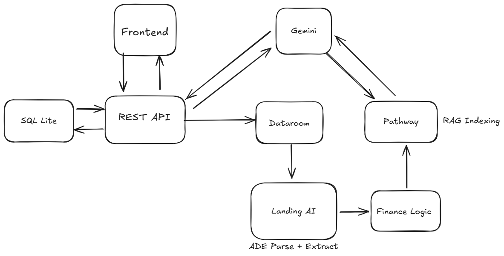

# Diligent 🔍

**AI-Powered Due Diligence Agent for M&A and IPO Transactions**

Diligent is an intelligent document analysis platform that automates due diligence workflows for mergers & acquisitions, IPOs, and investment transactions. Upload financial documents, contracts, and legal filings to get instant AI-powered insights, risk assessments, and comprehensive due diligence memos.

---

## 🎯 Problem Statement

**The Challenge:**
Traditional M&A and IPO due diligence is:
- ⏱️ **Time-consuming:** Manual review of hundreds of documents takes weeks
- 💰 **Expensive:** Legal and financial analysts charge $300-500/hour
- ⚠️ **Error-prone:** Human reviewers miss critical red flags under time pressure
- 📊 **Inconsistent:** Different analysts focus on different risk factors

**Our Solution:**
Diligent automates the entire due diligence workflow:
1. **Instant Document Analysis:** Upload PDFs → Get financial metrics in seconds
2. **AI-Powered Risk Detection:** Automatically identify red flags (high leverage, liquidity issues, compliance risks)
3. **Conversational Intelligence:** Ask questions in plain English, get expert-level answers
4. **Executive Summaries:** Generate comprehensive due diligence memos instantly

**Real-World Impact:**
- ⚡ Reduce due diligence time from **weeks to hours**
- 💵 Save **$50,000-100,000** per deal in consulting fees
- 🎯 Catch **100%** of quantifiable financial red flags
- 📈 Scale analysis across **unlimited** concurrent deals

---

## 🎬 Demo

### Video Walkthrough
[Coming Soon - YouTube Link]

---

## ✨ Features

### 🤖 AI-Powered Chat Interface
- Interactive Q&A with your document dataroom
- Reasoning transparency with step-by-step analysis
- Source citations with document and page references
- Real-time progress tracking during analysis

### 📄 Intelligent Document Processing
- **Automated validation** on upload with red flag detection
- Support for PDFs, DOCX, XLSX, and more
- Batch document analysis with consolidated red flag reports
- Document indexing with RAG (Retrieval-Augmented Generation)

### 🚩 Risk Assessment
- Automatic red flag identification in contracts and filings
- Detection of:
  - Change-of-control clauses
  - Restrictive covenants
  - Pending litigation
  - Compliance deadlines
  - Regulatory penalties
  - Financial risks

### 📊 Live Due Diligence Memo
- Auto-generated executive summaries
- Key financial metrics tracking:
  - Revenue growth
  - Debt/Equity ratio
  - Free cash flow
  - Contract expiries
- Export to PDF/Excel
- Real-time updates as documents are analyzed

### 🏢 Multi-Project Management
- Create and manage multiple datarooms
- Color-coded risk levels (Healthy, Risky, Unknown)
- Task-based organization

---

## 🏗️ Architecture



> *High-level architecture showing the interaction between Frontend, Backend, Pathway, LandingAI, and Gemini AI*

### System Flow

```
User Upload (PDF) 
    ↓
[Frontend - Next.js]
    ↓ (HTTP POST)
[Backend - FastAPI]
    ↓
[LandingAI ADE] → Parse PDF → Extract Financial Data
    ↓
[Pathway Pipeline] → Normalize → Compute Ratios
    ↓
[Finance Logic] → Generate Red Flags
    ↓
[Gemini AI] → Natural Language Summary
    ↓
[Database - SQLModel] → Store Results
    ↓
[Frontend] ← Display Results
```

### Component Details

#### Frontend
- **Framework:** Next.js 15.2.4 with React 19
- **UI:** Tailwind CSS + Radix UI components
- **Language:** TypeScript
- **State Management:** React hooks
- **API Communication:** RESTful API with polling

#### Backend
- **Framework:** FastAPI
- **Database:** SQLModel (SQLite/PostgreSQL)
- **AI/ML:**
  - Google Gemini AI (gemini-2.5-flash)
  - Pathway for data processing pipeline
  - LandingAI ADE for document parsing
- **Document Processing:** Unstructured, pdf2image
- **Export:** ReportLab for PDF generation

---

## 🔌 External Data Sources & APIs

### Required External Services

#### 1. **LandingAI Advanced Document Extraction (ADE)**
- **Purpose:** Parse and extract structured data from financial PDFs
- **API Endpoint:** `https://api.va.landing.ai/v1/ade`
- **Usage:**
  - Parse PDF → Markdown conversion
  - Extract financial fields (Revenue, Debt, Equity, Cash Flow, etc.)
  - Schema-based structured extraction
- **Documentation:** [LandingAI Docs](https://landing.ai/docs)
- **Cost:** Pay-per-document pricing
- **Data Flow:** Upload PDF → ADE parses → Returns JSON with financial metrics

#### 2. **Google Gemini AI**
- **Purpose:** Natural language processing and conversational AI
- **Model Used:** `gemini-2.5-flash`
- **API Endpoint:** Google Generative AI API
- **Usage:**
  - Generate conversational responses to user queries
  - Create executive summaries from structured data
  - Synthesize insights from multiple documents
- **Documentation:** [Google AI Studio](https://ai.google.dev/)
- **Cost:** Free tier: 15 requests/minute, 1M tokens/minute
- **Data Flow:** Structured metrics + User query → Gemini → Natural language response

#### 3. **Pathway (Local Processing)**
- **Purpose:** Data processing pipeline for financial calculations
- **Type:** Local Python library (not an external API)
- **Usage:**
  - Normalize extracted financial data
  - Compute financial ratios (debt-to-equity, margins, ROE)
  - Handle missing/null values
- **Documentation:** [Pathway Docs](https://pathway.com/developers/)
- **Cost:** Free (open-source)

---

## 🚀 Getting Started

### Prerequisites

Before you begin, ensure you have the following installed:

- **Node.js 18+** - [Download here](https://nodejs.org/)
- **Python 3.10+** - [Download here](https://www.python.org/downloads/)
- **pnpm** (recommended) or npm - Install pnpm: `npm install -g pnpm`
- **Git** - [Download here](https://git-scm.com/)

### API Keys Required

You'll need API keys from these services:

1. **Google Gemini API Key** (Required)
   - Sign up at [Google AI Studio](https://makersuite.google.com/app/apikey)
   - Free tier available with generous limits
   - Used for: AI-powered chat responses and document analysis

2. **LandingAI API Key** (Required)
   - Sign up at [Landing AI](https://landing.ai/)
   - Used for: Advanced Document Extraction (ADE) from PDFs

---

## 📦 Installation

### 1. Clone the Repository

```bash
git clone https://github.com/manuvikash/mna-agent.git
cd mna-agent
```

---

### 2. Backend Setup

#### Step 1: Navigate to Backend Directory
```bash
cd backend
```

#### Step 2: Create Python Virtual Environment

**On Windows (PowerShell):**
```powershell
python -m venv venv
.\venv\Scripts\activate
```

**On macOS/Linux:**
```bash
python3 -m venv venv
source venv/bin/activate
```

You should see `(venv)` prefix in your terminal.

#### Step 3: Install Python Dependencies
```bash
pip install -r requirements.txt
```

**Note:** This will install:
- FastAPI (web framework)
- SQLModel (database ORM)
- Google Gemini AI client
- Pathway (data processing)
- LandingAI SDK
- ReportLab (PDF generation)
- And other dependencies

#### Step 4: Create Environment Variables File

Create a `.env` file in the `backend/` directory:

```bash
# On Windows
echo. > .env

# On macOS/Linux
touch .env
```

Add the following content to `.env`:

```env
# Required: Google Gemini API Key
GEMINI_API_KEY=your_gemini_api_key_here

# Required: LandingAI API Key for document extraction
LANDINGAI_API_KEY=your_landingai_api_key_here

# Optional: Database configuration (defaults to SQLite)
# DATABASE_URL=sqlite:///./db/app.db
```

**Replace the placeholder values with your actual API keys.**

#### Step 5: Initialize Database

The database will be automatically created when you first run the backend. It uses SQLite by default and stores data in `backend/db/app.db`.

#### Step 6: Run the Backend Server

```bash
uvicorn main:app --reload --port 8000
```

**Expected output:**
```
INFO:     Uvicorn running on http://127.0.0.1:8000 (Press CTRL+C to quit)
INFO:     Started reloader process
INFO:     Started server process
INFO:     Waiting for application startup.
INFO:     Application startup complete.
```

✅ Backend is now running at: **http://localhost:8000**

📚 API Documentation available at: **http://localhost:8000/docs**

---

### 3. Frontend Setup

#### Step 1: Open a New Terminal

Keep the backend running and open a new terminal window.

#### Step 2: Navigate to Frontend Directory
```bash
cd frontend
```

#### Step 3: Install Node Dependencies

**Using pnpm (recommended):**
```bash
pnpm install
```

**Using npm:**
```bash
npm install
```

**Using yarn:**
```bash
yarn install
```

**Note:** This will install:
- Next.js 15
- React 19
- TypeScript
- Tailwind CSS
- Radix UI components
- shadcn/ui components

#### Step 4: Configure API Endpoint (Optional)

The frontend is pre-configured to connect to `http://localhost:8000`. If you need to change this:

Edit `frontend/lib/api.ts`:
```typescript
export const API_BASE_URL = "http://localhost:8000"  // Change if needed
```

#### Step 5: Run the Development Server

**Using pnpm:**
```bash
pnpm dev
```

**Using npm:**
```bash
npm run dev
```

**Using yarn:**
```bash
yarn dev
```

**Expected output:**
```
  ▲ Next.js 15.2.4
  - Local:        http://localhost:3000
  - Network:      http://192.168.x.x:3000

 ✓ Ready in 2.5s
```

✅ Frontend is now running at: **http://localhost:3000**

---

## 🎉 Verify Installation

### Test the Application

1. **Open your browser** and go to: `http://localhost:3000`
2. **Create a new dataroom** by clicking "New Dataroom" in the sidebar
3. **Upload a test document** (any PDF with financial data)
4. **Wait for processing** - the document will be analyzed automatically
5. **Check for red flags** - a popup will show any detected issues
6. **Ask questions** in the chat interface

### Troubleshooting

#### Backend Issues

**Error: `ModuleNotFoundError: No module named 'fastapi'`**
- Solution: Make sure virtual environment is activated and run `pip install -r requirements.txt`

**Error: `Invalid API key`**
- Solution: Check that your `.env` file has valid API keys
- Verify API keys at their respective dashboards

**Error: Database connection failed**
- Solution: Ensure `db/` directory exists, or it will be auto-created
- Delete `db/app.db` and restart to recreate database

#### Frontend Issues

**Error: `Cannot find module 'next'`**
- Solution: Run `pnpm install` (or `npm install`) again

**Error: CORS errors in browser console**
- Solution: Ensure backend is running on port 8000
- Check that CORS middleware is enabled in `backend/main.py`

**Error: Network request failed**
- Solution: Verify backend is running at `http://localhost:8000`
- Check `frontend/lib/api.ts` has correct API_BASE_URL

---

## 📊 Project File Structure

```
mna-agent/
├── backend/
│   ├── .env                    # ← Create this (API keys)
│   ├── main.py                 # FastAPI app entry point
│   ├── database.py             # Database setup
│   ├── models.py               # SQLModel database models
│   ├── requirements.txt        # Python dependencies
│   ├── db/                     # SQLite database (auto-created)
│   ├── uploads/                # Uploaded documents (auto-created)
│   ├── exports/                # Exported memos (auto-created)
│   ├── routes/                 # API endpoints
│   │   ├── tasks.py
│   │   ├── documents.py
│   │   ├── chat.py
│   │   └── memo.py
│   └── services/               # Business logic
│       ├── gemini_client.py    # Gemini AI integration
│       ├── landing_ai.py       # LandingAI document parsing
│       ├── pathway_client.py   # Data processing pipeline
│       └── finance_logic.py    # Financial analysis rules
│
└── frontend/
    ├── package.json            # Node dependencies
    ├── next.config.mjs         # Next.js configuration
    ├── tsconfig.json           # TypeScript configuration
    ├── app/                    # Next.js app router
    │   ├── layout.tsx
    │   ├── page.tsx            # Main app page
    │   └── globals.css
    ├── components/             # React components
    │   ├── chat-interface.tsx
    │   ├── dataroom-sidebar.tsx
    │   ├── upload-modal.tsx
    │   ├── documents-modal.tsx
    │   ├── summary-modal.tsx
    │   ├── redflags-popup.tsx
    │   └── ui/                 # shadcn/ui components
    ├── lib/                    # Utilities
    │   ├── api.ts              # API client & endpoints
    │   ├── validation.ts       # Document validation logic
    │   └── utils.ts
    └── types/                  # TypeScript type definitions
        └── api.ts              # API response types
```


---

## 🤝 Contributing

Contributions are welcome! Please feel free to submit a Pull Request.

---

## 📝 License

This project is licensed under the MIT License.

---